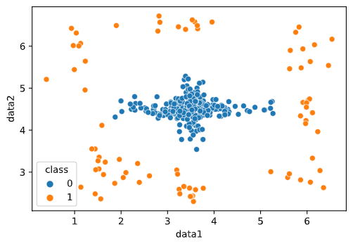

# Rapport et responses aux questions de projet
<center>Qinyue LIU et Shufeng JIANG</center>

## Partie donnnes

### Exo 2-1
Il y a 200 inliers et 80 outliers.
### Exo 2-2

### Exo 2-3
les données de inliers sont en centre de l'image, et les outliers se trouve sur les bords de l'image. Sur l'axis data1 (l'axis x), les inliers sont moins centre que sur l'axis data2 (l'axis y)

## Partie Evaluation

### Exo 3-1
Le modèle associe n'est pas bon, le nombre de outlisers est très peu compare avec le nombre de inliers. Les outliers predits comme ouliers sont très peu, le rappel est de 5/35 = 1/7, son abilité de prédire outliers est faible
### Exo 3-2
***L'exactitude*** de cette modèle est: 0.9691417550626809

***L'exactitude pondere*** de cette modèle est: 0.5704305674365554
### Exo 3-3
C'est car le modèle est très fort en prédire les inliers (1000/1002), et le nombre de outliers n'est pas beaucoup (que 35), il fait les predictions correctes quand le nombre de inliers est beaucoup plus que outliers, donc son exactitude est haut.
### Exo 3-4
Pour notre cas, il y a 200 inliers et 80 outliers, la proportion est de 5:2, mais la proportion de ce modele, dont 1002 inliers et 35 outliers, est presque 29:1, le modèle ressemble pas à notre données, donc il n'est pas pertinent.

### Exo 4-2
les structures de données utilisées sont suivant:
comme la condition Card(D) < 4 n'existe pas ici donc on n'a pas besoin de definir la class DirectDecision

```python
class Leaf:
    def __init__(self, D, attribIdx=1):
        self.outlier= False
        self.donne= D
        self.indice = attribIdx
        self.a = -1
        self.b = -1                
        self.out_left = None
        self.inlier = None
        self.out_right = None


class Node:
    def __init__(self,currentAttrib,a,b,L,M,R):
        self.node= Leaf(None,currentAttrib)
        ##
        self.node.indice = currentAttrib
        self.node.a = a
        self.node.b = b        
        self.node.out_left = L
        self.node.inlier = M
        #self.node.inlier.outlier= True
        self.node.out_right = R


class Tree:
    def __init__(self, D, central, attribIdx):
        self.tree=self.buildDecisionTree(D, central, attribIdx)
    #
    def buildDecisionTree(self, D, central, attribIdx):
        if (len(D)>=4) :
            if (len(attribIdx) >= 2) :
                currentAttrib = get_currentAttrib(df)
                array = get_array(D, currentAttrib)
                kmeans = get_kmean(array)

                a = float(kmeans.cluster_centers_[0])
                b = float(kmeans.cluster_centers_[1])
                data = get_data(currentAttrib)
                Dl= D[D[data]< a]
                
                #D.loc[D['class'] < a]D.loc[D['class'] < a]
                Dm= D[(D[data] > a) & (D[data] < b)]
                Dr=D[D[data]>b]
                attribIdx.remove(currentAttrib)
                L = self.buildDecisionTree(Dl, False, attribIdx)
                M = self.buildDecisionTree(Dm, True, attribIdx)
                M.outlier= True
                R = self.buildDecisionTree(Dr, False, attribIdx)
                return Node(attribIdx,a,b,L,M,R)
            else:
                return Leaf(D, attribIdx)
```
on exécute le code et obtenir les résultats suivant:
```bash
TN: 204  FP: 46

FN: 24  TP: 56
L'exactitude pondere de cette model est: 0.758
La précision de cette model est: 0.5490196078431373
Le rappel de cette model est: 0.7
```
#### discution:
Le rappel de cette modèle est bon (plus de 70%), donc cette modèle est forte à prédire les inliers correctement, cependant, sa précision n'est que 0.549, donc elle ne peut pas bien prédire les outliers correctement. L'exactitude est de 0.758, donc son taux de prédire correctement est de 75.8%.

### Exo 4-3
### 1.
on adapte l’algorithme 1 par remplacer "attribIdx" par "hauteur" 
```python
function buildDecisionTree(D, central, hauteur):
	if Card(D) ≥ 4 then
		if hauteur ≥ 2 then
			currentAttrib, a, b := getSplitParameters(D) 
			Dl , Dm , Dr := {x | xi ≤ a}, {x | a < xi ≤ b}, {x | b < xi } 
			hauteur = hauteur - 1
			L := buildDecisionTree(D l , False, hauteur) 
			M := buildDecisionTree(D m , True, hauteur) 
			R := buildDecisionTree(D r , False, hauteur) 
			return Node(currentAttrib, a, b, L, M , R) 
		else
			return DecisionLeaf(D, hauteur) 
			end
		end

```
### 2.
quand hauteur = 1, on créer qu'une feuille(Leaf) sans diviser les donées donc seuils, indice d’attribut et métrique reste les mêmes que 4.1

### 3.
le hauteur 4, car FN va être diminuer et l'exactitude va augementer
